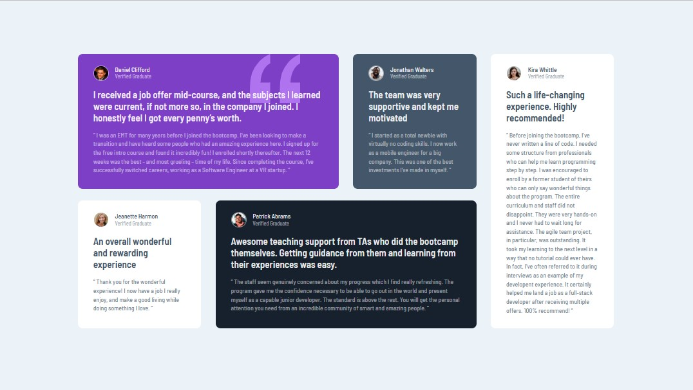

# Frontend Mentor - Testimonials grid section solution

This is a solution to the [Testimonials grid section challenge on Frontend Mentor](https://www.frontendmentor.io/challenges/testimonials-grid-section-Nnw6J7Un7). Frontend Mentor challenges help you improve your coding skills by building realistic projects.

## Table of contents

- [Overview](#overview)
  - [The challenge](#the-challenge)
  - [Screenshot](#screenshot)
  - [Links](#links)
- [My process](#my-process)
  - [Built with](#built-with)
  - [What I learned](#what-i-learned)
  - [Continued development](#continued-development)
  - [Useful resources](#useful-resources)
- [Author](#author)
- [Acknowledgments](#acknowledgments)

## Overview

### The challenge

Users should be able to:

- View the optimal layout for the site depending on their device's screen size

### Screenshot

| Desktop layout |
| :------------: |

| Mobile layout |
| :-----------: |

### Links

- Solution URL: [Add solution URL here](https://your-solution-url.com)
- Live Site URL: https://pavlinaps.github.io/fylo-data-storage-component-sass/

## My process

### Built with

- Semantic HTML5 markup
- CSS custom properties
- Flexbox
- Mobile-first workflow

### What I learned

This is a nice practice on css grid. In mobile view there is only one column, in desktop view changed in @media to 2 row and 4 column grid.

### Continued development

I need to practise grid more often.

### Useful resources

- [CSS Grid](https://cssgrid.io/) by Wes Bos

## Author

- Website - [My portfolio](https://pavlinaps.github.io/my-portfolio/)
- Frontend Mentor - [@PavlinaPs](https://www.frontendmentor.io/profile/PavlinaPs)
- Twitter - [@PPsarsky](https://www.twitter.com/PPsarsky)

## Acknowledgments

It is great that I can solve Frontend Mentor's challenges. They are all very useful for me. Every single one. Thank you!
